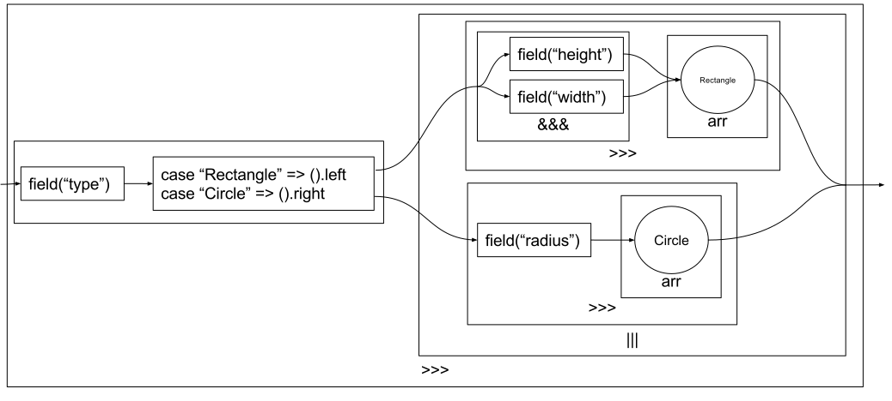

% Do it with (*free*?) arrows!
% Julien Richard-Foy <julien.richard-foy@epfl.ch>
   
  Typelevel Summit Copenhagen -- June 3, 2017
   
  [http://julienrf.github.io/2017/arrows](http://julienrf.github.io/2017/arrows)

# What is this talk about?

### What is a monad? {.unnumbered}

~~~ scala
trait Monad[F[_]] {
  def point[A](a: A): F[A]
  def bind[A, B](fa: F[A])(f: A => F[B]): F[B]
}
~~~

### What is an arrow? {.unnumbered}

For $C$ any category, its *arrow category* $Arr(C)$ is the category such that:

- an object $a$ of $Arr(C)$ is a morphism $a: a_0 \rightarrow{} a_1$ of $C$;
- a morphism $f: a \rightarrow{} b$ of $Arr(C)$ is a commutative
  square   in $C$;
- composition in $Arr(C)$ is given simply by placing commutative squares side
  by side to get a commutative oblong.

### Power? Constraint? {.unnumbered}

> Monads are more *powerful* than applicative functors

- What kind of **power** are we talking about?
- Can this power be seen as a **constraint**?

### Goals of this talk {.unnumbered}

- Make these things more **intuitive**
- Have **fun**

#### Secondary goals {.unnumbered}

- Make the world a **better place**

### Non-goals of this talk {.unnumbered}

- Explain what a *free monad* is

### Agenda {.unnumbered}

- Context
- Applicative Functor
- Monad
- Arrow

# Context

## Description vs interpretation

### Description vs interpretation {.unnumbered}

### Description: HTML document {.unnumbered}

~~~ html
<html>
  <head><title>This is not a title</title></head>
  <body/>
</html>
~~~

### Description: arithmetic expression {.unnumbered}

~~~ scala
1 + 1   // This is not an addition
~~~

### The essence of descriptions {.unnumbered}

> - “atoms” (`1`, `"foo"`, `point(1, 2)`)
> - operators (`+`, `concat`, `move`)

### Interpretation**s** {.unnumbered}

---------------------------------------------------
Description        Interpretations
------------------ --------------------------------
HTML document      rendering

arithmetic         evaluation, simplification,
expression         pretty print

image              draw on screen, generate a file

API endpoint       client, server, documentation
---------------------------------------------------

### Interpretations {.unnumbered}

- Transform (optimize)
- Evaluate
- Generate (code, assets)

## Domain: data

### Data description {.unnumbered}

- Records with fields
- Sum types

### Interpretations of data descriptions {.unnumbered}

- serialization
- deserialization
- schema documentation
- lenses
- UI form
- …

### Let’s design a *data description language* {.unnumbered}

~~~ scala
trait DataDescr {

  /** A description of data of type `A` */
  type Data[A]

  /** “axiom” describing a record with one
    * field of type `String`
    */
  def field(name: String): Data[String]

}
~~~

### Let’s try our `DataDescr` language {.unnumbered}

~~~ scala
trait Program extends DataDescr {

  /**
    * A record with one field named “x”
    * and containing a `String` value
    */
  val x: Data[String] = field("x")

}
~~~

### Let’s describe a `User` data type (1) {.unnumbered}

~~~ scala
trait Program extends DataDescr {

  case class User(name: String, email: String)

}
~~~

### Let’s describe a `User` data type (2) {.unnumbered}

~~~ scala
trait Program extends DataDescr {

  case class User(name: String, email: String)

  val user: Data[User] = {

    ???
  }

}
~~~

### Let’s describe a `User` data type (3) {.unnumbered}

~~~ scala
trait Program extends DataDescr {

  case class User(name: String, email: String)

  val user: Data[User] = {
    val name  = field("name")

    ???
  }

}
~~~

### Let’s describe a `User` data type (4) {.unnumbered}

~~~ scala
trait Program extends DataDescr {

  case class User(name: String, email: String)

  val user: Data[User] = {
    val name  = field("name")
    val email = field("email")
    ???
  }

}
~~~

# Applicative Functor

## We need the power of applicative functors!

### Let’s upgrade our language {.unnumbered}

~~~ scala
import scalaz.Applicative

trait DataDescr {

  type Data[A]

  def field(name: String): Data[String]

  /** Pretend that `Data[_]` is an applicative functor */
  implicit val applicativeData: Applicative[Data]

}
~~~

### Feel the power! (1) {.unnumbered}

~~~ scala
import scalaz.syntax._

trait Program extends DataDescr {

  case class User(name: String, email: String)

  val user: Data[User] = {
    val name  = field("name")
    val email = field("email")
    (name tuple email) // Data[(String, String)]
  }

}
~~~

### Feel the power! (2) {.unnumbered}

~~~ scala
import scalaz.syntax._

trait Program extends DataDescr {

  case class User(name: String, email: String)

  val user: Data[User] = {
    val name  = field("name")
    val email = field("email")
    (name tuple email).map(User.tupled)
  }

}
~~~

### Intuition of an applicative functor {.unnumbered}

~~~ scala
val name: Data[String] = …
val email: Data[String] = …
val user: Data[User] = (name tuple email).map(User.tupled)
~~~

- We can turn **several** records into a **single** record containing
  all of their fields

### `Data[User]`? {.unnumbered}

- But what is a `Data[User]`?
- We don’t know yet! `Data` is still an abstract type
- Interpreters will give `Data` a concrete meaning

## Interpreters

### `Decoder`  {.unnumbered}

~~~ scala
trait Decoder extends DataDescr {

  type Data[A] = Map[String, String] => Option[A]

  // … (implementation of `field` and `applicativeData`)
}
~~~

### `Documentation`  {.unnumbered}

~~~ scala
trait Documentation extends DataDescr {

  type Data[A] = Record
  case class Record(fields: List[String])

  // … (implementation of `field` and `applicativeData`)
}
~~~

# Monad

## Sum types description

### Is our language powerful enough to describe this data type? {.unnumbered}

~~~ scala
sealed trait Shape
case class Circle(radius: String) extends Shape
case class Rectangle(width: String, height: String) extends Shape
~~~

~~~
val kvs =
  Map(
    "type" -> "Circle",
    "radius" -> "42"
  )
~~~

### Attempt {.unnumbered}

~~~ scala
sealed trait Shape
case class Circle(radius: String) extends Shape
case class Rectangle(width: String, height: String) extends Shape
~~~

~~~ scala
val shape: Data[Shape] = {
  val tpe = field("type")
  val circle = field("radius").map(Circle)
  val rectangle =
    (field("width") tuple field("height")).map(Rectangle.tupled)
  ???
}
~~~

### Monads to the rescue {.unnumbered}

~~~ scala
import scalaz.Monad

trait DataDescr {

  type Data[A]

  def field(name: String): Data[String]

  /** Pretend that `Data[_]` is a monad */
  implicit val monadData: Monad[Data]

}
~~~

### Feel the power of the monad! {.unnumbered}

~~~ scala
val shapeData: Data[Shape] = {

  val circle: Data[Shape] = field("radius").map(Circle)
  val rectangle: Data[Shape] =
    (field("width") tuple field("height")).map(Rectangle.tupled)

  for {
    tpe   <- field("type")
    shape <- tpe match {
      case "Circle" => circle
      case "Rectangle" => rectangle
    }
  } yield shape
}
~~~

### Intuition of a *monad* {.unnumbered}

- Can do all the things an applicative functor can do
- Can describe a type according to the **actual value** of
  another type

## Interpreters

### `Decoder`  {.unnumbered}

~~~ scala
trait Decoder extends DataDescr {

  type Data[A] = Map[String, String] => Option[A]

  // … (implementation of `monadData`)

}
~~~

### `Documentation`  {.unnumbered}

~~~ scala
trait Documentation extends DataDescr {

  type Data[A] = Record
  case class Record(fields: List[String])

  val monadData: Monad[Data] = ???

}
~~~

### `Documentation`  {.unnumbered}

~~~ scala
trait Documentation extends DataDescr {

  type Data[A] = Record
  case class Record(fields: List[String])

  val monadData: Monad[Data] =
    new Monad[Data] {
      def point[A](x: A): Data[A] = ???
      def bind[A, B](fa: Data[A])(f: A => Data[B]): Data[B] = ???
    }

}
~~~

### `Documentation`  {.unnumbered}

~~~ scala
trait Documentation extends DataDescr {

  type Data[A] = Record
  case class Record(fields: List[String])

  val monadData: Monad[Data] =
    new Monad[Data] {
      def point[A](x: A): Record = ???
      def bind[A, B](fa: Record)(f: A => Record): Record = ???
    }

}
~~~

### `Documentation`  {.unnumbered}

~~~ scala
trait Documentation extends DataDescr {

  type Data[A] = Record
  case class Record(fields: List[String])

  val monadData: Monad[Data] =
    new Monad[Data] {
      def point[A](x: A): Record = Record(Nil)
      def bind[A, B](fa: Record)(f: A => Record): Record = ???
    }

}
~~~

### `Documentation`  {.unnumbered}

~~~ scala
trait Documentation extends DataDescr {

  type Data[A] = Record
  case class Record(fields: List[String])

  val monadData: Monad[Data] =
    new Monad[Data] {
      def point[A](x: A): Record = Record(Nil)
      def bind[A, B](fa: Record)(f: A => Record): Record = fa
    }

}
~~~

### `Documentation`  {.unnumbered}

- Where are the record fields???

### Monads: summary {.unnumbered}

- User point of view
    - **greater** power: describe a data type based on
      the information contained in another data type’s
      instance
- Interpreter point of view
    - **too much** power: we can not anymore give
      a useful `Documentation` implementation…
- Couldn’t we find a better **compromise**?

# Arrow

### Let’s make our `Data` an arrow {.unnumbered}

~~~ scala
trait DataDescr {

  /** Description of a data type */
  type Data[In, Out]
  /** Raw format of data */
  type Raw

  /** Describes a record with one field */
  def field(name: String): Data[Raw, String]

  /** Pretend that `Data[_, _]` is an arrow */
  implicit val arrowData: Arrow[Data]

}
~~~

## Describing data types with arrows

### Record types {.unnumbered}

~~~ scala
import scalaz.syntax.all._

trait Program exends DataDescr {
  import arrowData._

  case class User(name: String, email: String)

  def userData: Data[Raw, User] = {
    val name  = field("name")
    val email = field("email")
    (name &&& email) // Data[Raw, (String, String)]
  }

}
~~~

### Record types {.unnumbered}

~~~ scala
import scalaz.syntax.all._

trait Program exends DataDescr {
  import arrowData._

  case class User(name: String, email: String)

  def userData: Data[Raw, User] = {
    val name  = field("name")
    val email = field("email")
    (name &&& email) >>> arr(User.tupled)
  }

}
~~~

### Record types {.unnumbered}

### Intuition of an *arrow* {.unnumbered}

- combine processing steps, **sequentially** (`>>>`)
  or **in parallel** (`&&&`)

### Sum types {.unnumbered}

~~~ scala
sealed trait Shape
case class Circle(radius: String) extends Shape
case class Rectangle(width: String, height: String) extends Shape

val shapeDecoder: Data[Raw, Shape] = {

  val circle: Data[Raw, Shape] = field("radius") >>> arr(Circle)

  val rectangle: Data[Raw, Shape] =
    (field("width") &&& field("height")) >>> arr(Rectangle.tupled)

  val tpe = field("type")
  ???
}
~~~

### Sum types {.unnumbered}

- We still miss some power…

# Choice

### Add the power of making choices {.unnumbered}

~~~ scala
trait DataDescr {

  /** Pretend that `Data[_, _]` is an arrow with choice */
  implicit val arrowChoiceData: Arrow[Data] with Choice[Data]

}
~~~

### Can we now describe sum types? {.unnumbered}

~~~ scala
val shapeDecoder: Data[Raw, Shape] = {
  import arrowChoiceData._

  val circle: Data[Raw, Shape] = …
  val rectangle: Data[Raw, Shape] = …

  val tpe: Data[Raw, Unit \/ Unit] =
    field("type") >>> arr((_: String) match {
      case "Circle"    => ().left
      case "Rectangle" => ().right
    }

  tpe.withFst >>> (circle ||| rectangle)
}
~~~

### `shapeDecoder`  {.unnumbered}

### Intuition of *choice* {.unnumbered}

- **fan in**: merge alternative branches

## Can we also implement a (useful) documentation interpreter? {.unnumbered}

### `Documentation`  {.unnumbered}

~~~ scala
trait Documentation extends DataDescr {

  type Data[A, B] = ???
  type Raw = ???

  implicit val arrowChoiceData: Arrow[Data] with Choice[Data] = ???

}
~~~

### `Documentation`  {.unnumbered}

~~~ scala
trait Documentation extends DataDescr {

  type Data[A, B] = ???
  type Raw = Nothing

  implicit val arrowChoiceData: Arrow[Data] with Choice[Data] = ???

}
~~~

### `Documentation`  {.unnumbered}

~~~ scala
trait Documentation extends DataDescr {

  type Data[A, B] = ???
  type Raw = Nothing

  case class Record(fields: List[String])

  implicit val arrowChoiceData: Arrow[Data] with Choice[Data] = ???

}
~~~

### `Documentation`  {.unnumbered}

~~~ scala
trait Documentation extends DataDescr {

  type Data[A, B] = ???
  type Raw = Nothing

  sealed trait Adt
  case class Record(fields: List[String]) extends Adt
  case class CoProd(alternatives: List[Record]) extends Adt

  implicit val arrowChoiceData: Arrow[Data] with Choice[Data] = ???

}
~~~

### `Documentation`  {.unnumbered}

~~~ scala
trait Documentation extends DataDescr {

  type Data[A, B] = Adt
  type Raw = Nothing

  sealed trait Adt
  case class Record(fields: List[String]) extends Adt
  case class CoProd(alternatives: List[Record]) extends Adt

  implicit val arrowChoiceData: Arrow[Data] with Choice[Data] = ???

}
~~~

### `Documentation`  {.unnumbered}

~~~ scala
sealed trait Adt
case class Record(fields: List[String]) extends Adt
case class CoProd(alternatives: List[Record]) extends Adt

implicit val arrowChoiceData: Arrow[Data] with Choice[Data] =
  new Arrow[Data] with Choice[Data] {
    // …
  }
~~~

### `Documentation`  {.unnumbered}

~~~ scala
sealed trait Adt
case class Record(fields: List[String]) extends Adt
case class CoProd(alternatives: List[Record]) extends Adt

implicit val arrowChoiceData: Arrow[Data] with Choice[Data] =
  new Arrow[Data] with Choice[Data] {

    def compose[A, B, C](f: Data[B, C], g: Data[A, B]): Data[A, C] = ???

    // …
  }
~~~

### `Documentation`  {.unnumbered}

~~~ scala
sealed trait Adt
case class Record(fields: List[String]) extends Adt
case class CoProd(alternatives: List[Record]) extends Adt

implicit val arrowChoiceData: Arrow[Data] with Choice[Data] =
  new Arrow[Data] with Choice[Data] {

    def compose[A, B, C](f: Adt, g: Adt): Adt = ???

    // …
  }
~~~

### `Documentation`  {.unnumbered}

~~~ scala
sealed trait Adt
case class Record(fields: List[String]) extends Adt
case class CoProd(alternatives: List[Record]) extends Adt

implicit val arrowChoiceData: Arrow[Data] with Choice[Data] =
  new Arrow[Data] with Choice[Data] {

    def compose[A, B, C](f: Adt, g: Adt): Adt =
      (f, g) match {
        case (Record(fs1), Record(fs2)) => Record(fs1 ++ fs2)
      }

    // …
  }
~~~

### `Documentation`  {.unnumbered}

~~~ scala
sealed trait Adt
case class Record(fields: List[String]) extends Adt
case class CoProd(alternatives: List[Record]) extends Adt

implicit val arrowChoiceData: Arrow[Data] with Choice[Data] =
  new Arrow[Data] with Choice[Data] {

    def compose[A, B, C](f: Adt, g: Adt): Adt =
      (f, g) match {
        case (Record(fs1), Record(fs2)) => Record(fs1 ++ fs2)
        case (CoProd(as1), CoProd(as2)) => CoProd(as1 ++ as2)
      }

    // …
  }
~~~

### `Documentation`  {.unnumbered}

~~~ scala
sealed trait Adt
case class Record(fields: List[String]) extends Adt
case class CoProd(alternatives: List[Record]) extends Adt

implicit val arrowChoiceData: Arrow[Data] with Choice[Data] =
  new Arrow[Data] with Choice[Data] {

    def compose[A, B, C](f: Adt, g: Adt): Adt =
      (f, g) match {
        case (Record(fs1), Record(fs2)) => Record(fs1 ++ fs2)
        case (CoProd(as1), CoProd(as2)) => CoProd(as1 ++ as2)
        case (Record(fs1), CoProd(as2)) => CoProd(as2.map(r => Fields(r.fields ++ fs1)))
        case (CoProd(as1), Record(fs2)) => coProd(as1.map(r => Fields(r.fields ++ fs2)))
      }

    // …
  }
~~~

### `Documentation`  {.unnumbered}

~~~ scala
sealed trait Adt
case class Record(fields: List[String]) extends Adt
case class CoProd(alternatives: List[Record]) extends Adt

implicit val arrowChoiceData: Arrow[Data] with Choice[Data] =
  new Arrow[Data] with Choice[Data] {

    def choice[A, B, C](f: Data[A, C], g: Data[B, C]): Data[A \/ B, C] = ???

    // …
  }
~~~

### `Documentation`  {.unnumbered}

~~~ scala
sealed trait Adt
case class Record(fields: List[String]) extends Adt
case class CoProd(alternatives: List[Record]) extends Adt

implicit val arrowChoiceData: Arrow[Data] with Choice[Data] =
  new Arrow[Data] with Choice[Data] {

    def choice[A, B, C](f: Adt, g: Adt): Adt = ???

    // …
  }
~~~

### `Documentation`  {.unnumbered}

~~~ scala
sealed trait Adt
case class Record(fields: List[String]) extends Adt
case class CoProd(alternatives: List[Record]) extends Adt

implicit val arrowChoiceData: Arrow[Data] with Choice[Data] =
  new Arrow[Data] with Choice[Data] {

    def choice[A, B, C](f: Adt, g: Adt): Adt =
      (f, g) match {
        case (r1: Record,  r2: Record)  => CoProd(r1 :: r2 :: Nil)
      }

    // …
  }
~~~

### `Documentation`  {.unnumbered}

~~~ scala
sealed trait Adt
case class Record(fields: List[String]) extends Adt
case class CoProd(alternatives: List[Record]) extends Adt

implicit val arrowChoiceData: Arrow[Data] with Choice[Data] =
  new Arrow[Data] with Choice[Data] {

    def choice[A, B, C](f: Adt, g: Adt): Adt =
      (f, g) match {
        case (r1: Record,  r2: Record)  => CoProd(r1 :: r2 :: Nil)
        case (CoProd(as1), CoProd(as2)) => CoProd(as1 ++ as2)
      }

    // …
  }
~~~

### `Documentation`  {.unnumbered}

~~~ scala
sealed trait Adt
case class Record(fields: List[String]) extends Adt
case class CoProd(alternatives: List[Record]) extends Adt

implicit val arrowChoiceData: Arrow[Data] with Choice[Data] =
  new Arrow[Data] with Choice[Data] {

    def choice[A, B, C](f: Adt, g: Adt): Adt =
      (f, g) match {
        case (r1: Record,  r2: Record)  => CoProd(r1 :: r2 :: Nil)
        case (CoProd(as1), CoProd(as2)) => CoProd(as1 ++ as2)
        case (r1: Record,  CoProd(as2)) => CoProd(r1 :: as2)
      }

    // …
  }
~~~

### `Documentation`  {.unnumbered}

~~~ scala
sealed trait Adt
case class Record(fields: List[String]) extends Adt
case class CoProd(alternatives: List[Record]) extends Adt

implicit val arrowChoiceData: Arrow[Data] with Choice[Data] =
  new Arrow[Data] with Choice[Data] {

    def choice[A, B, C](f: Adt, g: Adt): Adt =
      (f, g) match {
        case (r1: Record,  r2: Record)  => CoProd(r1 :: r2 :: Nil)
        case (CoProd(as1), CoProd(as2)) => CoProd(as1 ++ as2)
        case (r1: Record,  CoProd(as2)) => CoProd(r1 :: as2)
        case (CoProd(as1), r2: Record)  => CoProd(r2 :: as1)
      }

    // …
  }
~~~

### Arrows and choice: summary {.unnumbered}

- Arrows (with choice), like monads, provide enough expressive power to describe
  record types and sum types
- Like applicative functors, they support a (useful) documentation interpreter

### Arrows are relevant for… {.unnumbered}

- Business rules
- Pipelines of data transformations
- FRP (e.g. [yampa](https://wiki.haskell.org/Yampa))

# Summary

### Summary {.unnumbered}

> - We compared the **expressive power** of the operations provided by three **notions of computation** (applicative functors, arrows and monads)
> - We observed that when we **increase the expressive power** for users, at the same time we **decrease our ability to give useful meanings** to their code
>     - See also “Constraints liberate, liberties constrain”, Rúnar Bjarnason, 2015 [[video](https://www.youtube.com/watch?v=GqmsQeSzMdw)]
> - Arrows (with choice) provide a **compromise** between applicative
  functors and monads
>     - Users benefit from **more expressive power** than with applicative functors
>     - Interpreters are **less constrained** than with monads

# Questions?

# Bonus

## Final encoding

### Final encoding {.unnumbered}

- [[Kiselyov 2012](http://okmij.org/ftp/tagless-final/course/lecture.pdf)]
- [[Blanvillain 2017](https://gist.github.com/OlivierBlanvillain/48bb5c66dbb0557da50465809564ee80)]

## Some other friends of arrows

### BiArrow {.unnumbered}

- Similar to arrows, but **invertible** [[Alimarine et al. 2005](http://ftp.sci.kun.nl/CSI/SoftwEng.FunctLang/papers/2005/alia2005-biarrowsHaskellWorkshop.pdf)]
- Examples of use cases
    - parser / pretty printer [[Rendel et al. 2010](http://camlunity.ru/swap/Library/Computer%20Science/Parsers/Invertible%20Syntax%20Descriptions.%20Unifying%20Parsing%20and%20Pretty-Printing.pdf)]
    - codecs
    - lenses [[Pickering 2017](https://arxiv.org/pdf/1703.10857)]

### Cartesian Closed Categories {.unnumbered}

- Cartesian closed categories (CCCs) can model lambda calculus
- Examples of use cases
    - embedded DSLs
    - meta-programming
- See also [[Elliott 2017](http://conal.net/papers/compiling-to-categories/compiling-to-categories.pdf)]
